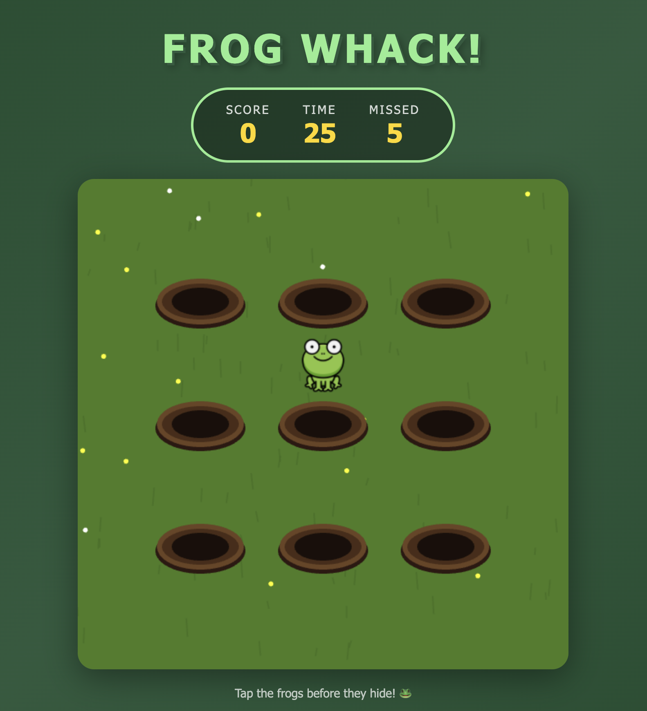

# 🐸 Frog Whack!

A fun and addictive whack-a-mole style game featuring cute frogs! Built with PixiJS.

## 🎮 Play Now

**[👉 Play Frog Whack! on Netlify](https://kulkulkatak.netlify.app)**

## 📸 Screenshot



## ✨ Features

- 🐸 **Cute Frog Characters** - Whack adorable frogs as they pop up from holes
- 👻 **Ghost Animation** - Watch frogs turn into cute ghosts when whacked
- 🔊 **Sound Effects** - Satisfying frog croak sound on each successful hit
- ⚙️ **Customizable Settings** - Adjust game difficulty with configurable parameters
- 🎯 **5 Difficulty Presets** - From Relaxed to Insane difficulty levels
- 🌿 **Beautiful Yard Theme** - Green grass background with decorative flowers
- 📱 **Responsive Design** - Works on desktop and mobile devices
- 🎨 **Smooth Animations** - Bouncy pop-up and fade-out transitions

## 🎯 How to Play

1. **Watch the holes** - Frogs will randomly pop up from 9 holes
2. **Tap/Click the frogs** - Hit them before they disappear!
3. **Score points** - Each successful hit gives you 1 point
4. **Beat the clock** - You have 30 seconds to score as high as possible
5. **Avoid misses** - The missed counter tracks escaped frogs

## ⚙️ Game Settings

Click the **⚙️ Settings** button to customize your game experience:

### Difficulty Presets

| Level | Difficulty | Description                     |
| ----- | ---------- | ------------------------------- |
| 1     | Relaxed 😌 | Frogs stay longer, spawn slowly |
| 2     | Easy 🌱    | Good for beginners              |
| 3     | Medium ⚡  | Balanced challenge (default)    |
| 4     | Hard 💪    | Quick reflexes needed           |
| 5     | Insane 🔥  | For experts only!               |

### Custom Settings

- **Frog Show Time (Min/Max)**: 500-2000ms - How long frogs stay visible
- **Spawn Interval (Min/Max)**: 500-2000ms - Time between frog spawns

## 🚀 Run Locally

1. **Clone the repository**

   ```bash
   git clone https://github.com/yourusername/holemole.git
   cd holemole
   ```

2. **Start a local server** (required for asset loading)

   ```bash
   # Using Python
   python3 -m http.server 8080

   # Or using Node.js
   npx serve
   ```

3. **Open in browser**
   ```
   http://localhost:8080
   ```

## 📁 Project Structure

```
holemole/
├── index.html          # Main game page with UI and settings
├── game.js             # PixiJS game logic
├── README.md           # This file
└── assets/
    ├── frog.png        # Frog sprite
    ├── ghost.png       # Ghost sprite (death effect)
    ├── sounds/
    │   └── frog-croak.mp3  # Whack sound effect
    └── screenshots/
        └── Screenshot-1.png
```

## 🛠️ Tech Stack

- **[PixiJS 7](https://pixijs.com/)** - 2D WebGL renderer
- **HTML5 Canvas** - Game rendering
- **Vanilla JavaScript** - Game logic
- **CSS3** - UI styling and animations

## 🎨 Game Elements

- **Green Yard Background** - With grass blades and flower decorations
- **9 Brown Holes** - Arranged in 3x3 grid with realistic depth effect
- **Frog Sprites** - Pop up with bounce animation
- **Ghost Sprites** - Float up and fade out when frog is whacked
- **Screen Shake** - Visual feedback on successful hits

## 📄 License

MIT License - Feel free to use, modify, and distribute!

---

Made with 💚 and lots of frog whacking!
